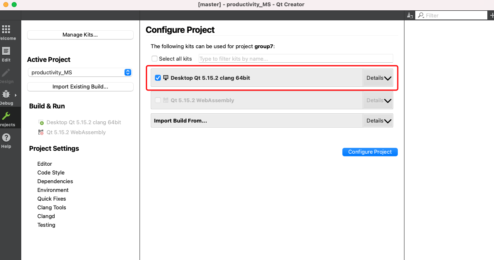
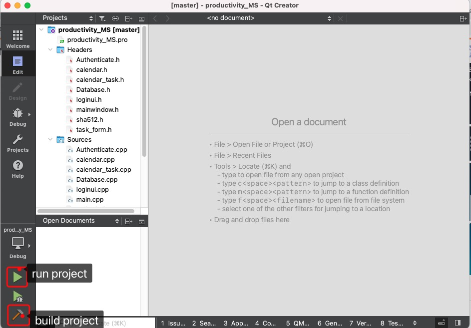

## Environment Requirement: 

- Sqlite3
- qt 5.15 LTS
- c++ 11

There are two ways to build up the project: qmake and qcreator. We recommand building the project by using qmake; however, if this way does not work on your system, please try the way using qt creator. 

## Build Project Using qmake

- If your operating system is Mac OS, make sure you have every requirement setup 

  1. Step 1: install every requirement 

  - for qt installation: `brew install qt`
  - for sqlite3 installation: `brew install sqlite`
  - also, make sure you install <mark> xcode </mark> 

  2. Step 2: cd to the directory that contains the file "productivity_MS.pro"
  3. Step 3: run command `qmake -spec macx-clang productivity_MS.pro`
  4. Step 4: run `make` to build project and it will generate an execuatable in the current directory 

- If your operating system is linux (some documents can be found onhttps://doc.qt.io/qt-5/qmake-running.html)

  1. Step1: install every requirement:

     - for sqlite3 installation: 

     1. `sudo apt-get install sqlite3`
     2. `sudo apt install libsqlite3-dev`

     - for qt5-make: `sudo apt-get install -y qt5-qmake`

  2. Step2: cd to the directory that contains the file "productivity_MS.pro"

  3. Step3: run command `qmake productivity_MS.pro`

  4. Step 4: run `make` to build project and it will generate an execuatable in the current directory, to run it: do ./productivity_MS

## Build Project Using Qt Creator

1. Download the community version of QT online installer (https://www.qt.io/download-open-source?hsCtaTracking=e9c17691-91a0-4616-9bc2-1a6a6c318914%7C963686f8-2c68-442a-b17b-3d73ce95b819) if you are using linux, you can also check this resource for qt creator installation: https://web.stanford.edu/dept/cs_edu/resources/qt/install-linux

2. On Qt maintenance tool or QT online installer, first log in to Qt account 

3. Install Qt 5.15.2, under Qt 5.15.2 categtory  

   1. chooce macOS/windows/linux
   2. chooce Sources

4. After successfully install Qt and Qt creator, open Qt Creator

5. On Qt Creartor, Click "open project" button, choose file "productivity_MS.pro"

6. Configuration of the project, make sure the kit is "Desktop Qt 5.15.2 clang 64bit"

   

7. Build and run project

   
